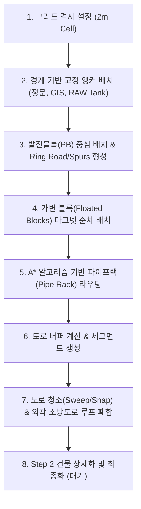
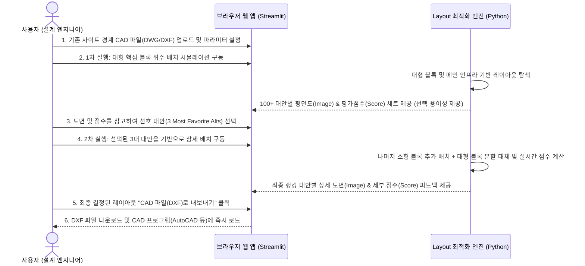

# 🚀 PowerPlan AI: Layout 개발 방법론 및 UX 정의서

본 문서는 PowerPlan AI (Layout_Gen_Design) 프로그램 개발 진행 시 적용된 기술적 개발 방법론(Development Methodology)과 사용자에게 제공되는 전체적인 UX(User Experience) 정의를 체계적으로 정리한 참조 가이드입니다.

---

## §1. Layout 개발 방법론 (Development Methodology)

PowerPlan AI는 단순한 무작위 배치나 무거운 최적화 알고리즘에 의존하는 대신, 그리드 기반(Grid-First) 및 인프라 우선(Infrastructure-First) 원칙에 따른 규칙 기반의 순차 생성 시스템을 채택하고 있습니다.



### 1.1 Grid-First 좌표계 및 스냅 규격
* 이유: 연속 좌표계(Phase 05) 대비 탐색 공간을 줄이고 연산 정밀도를 높이기 위해 도입되었습니다.
* 그리드 셀 크기: `CELL_SIZE = 2m`. 모든 건물 배치, 도로 중심선, 파이프랙 경로는 2m 그리드 격자에 맞춰 정수형 스냅 처리됩니다 (`snap(v) = round(v / 2) * 2`).
* 고정 제약 척도:
  - 기본 건물 이격 거리(Road Buffer): `8m` (비-랙 블록에서 도로 중심선까지)
  - 건물 간 최소 간격(Block Buffer): `16m` (파이프랙이 없는 면끼리 마주할 때)
  - 외곽 소방도로 오프셋: 경계로부터 `5m` 후퇴(Setback) + 도로 폭 `8m` (중심선은 경계로부터 `9m` 위치)

### 1.2 Infrastructure-First (인프라 및 도로망 우선 설계)
* 핵심 철학: 건물을 먼저 배치하고 도로를 끼워 넣는 것이 아니라, 도로와 파이프랙망을 뼈대로 삼아 그 주변에 건물을 배치합니다.
* 랙의 최우선순위: 파이프랙 코리더는 소방도로나 접근 도로보다 먼저 생성됩니다. 도로는 파이프랙이 확보한 공간(Case 1, Case 2)을 침범하지 않고 우회하도록 설계되어 물리적 간섭을 원천 방지합니다.

### 1.3 계층적 순차 배치 시퀀스 (Master Placement Sequence)
배치 프로그램은 규칙의 강도와 중요도에 따라 아래 계층 구조로 배치합니다.
1. 고정 앵커(Fixed Anchors): 경계선 및 특정 축에 묶여 있는 시설물(`정문 Gate House`, `GIS`, `RAW Water Tank`)을 슬라이딩 지터(±5% 범위 내 미세 변동)를 주어 경계면에 부착 배치합니다.
2. 발전 블록(Power Block): 부지의 중심점 기준으로 배치하되, 가로/세로 부지 여유에 따른 지터링과 정문과의 충돌 방지 차단선(Gate-side stop line) 규칙을 적용하여 물리적으로 고정합니다.
3. 발전블록 순환선 및 진입로(PB Ring Road & Gate Spur): 발전소 가동의 중추가 되는 뼈대 도로망을 최초로 캔버스에 그립니다.
4. 가변 블록(Floated Blocks): 남은 건물들(`Cooling Tower`, `WT/WWT`, `Warehouse`, `Flare`, `Admin`, `Demi Water Tank`)을 기배치된 블록들과의 최소 이격 거리(`pair_min_gap`)를 충족하면서, 인력/자석처럼 달라붙는 마그넷 배치 전략(Magnet Placement)을 통해 위치 후보지를 정합니다. 
   - 구역 필터(Zone Filter): 바람 길에 영향을 받는 시설(Cooling Tower, Flare 등)은 풍향에 따른 leeward(피풍측) 구역에 제한하여 배치합니다.

### 1.4 다단계 경계 유연성 알고리즘 (3-Pass Boundary Tolerance)
부지의 넓이가 협소하여 모든 규칙을 완벽히 충족하기 어려울 때를 대비해, 배치 엔진(`Layout06.py`)은 경계 오프셋 강도를 낮추며 최대 3번 재시도합니다.
* Pass 1 (Ideal/Strict): 부지 경계선 내부로 18m 이상의 안전 마진을 확보하여 배치 (`boundary_tol = -18m`).
* Pass 2 (Standard): 경계선을 초과하지 않고 부지 내에 완전히 가두어 배치 (`boundary_tol = 0m`).
* Pass 3 (Tight Site/Flexible): 극도로 협소한 부지인 경우, 특정 가변 블록들이 부지 경계 밖으로 최대 10m 넘어가도록 허용하여 배치 성공률을 보장 (`boundary_tol = +10m`).

### 1.5 알고리즘 기반 파이프랙 및 소방도로 생성
* A* 최단 경로 파이프랙 라우팅: 6m 폭의 파이프랙이 충돌을 방지하며 워터 클러스터(RAW, Demi, WT/WWT) 삼각망과 발전 블록을 최단 직교 경로로 자동 연계합니다.
* 도로망 단순화(Cleanup): 접근 도로 및 소방 도로가 생성된 후, 평행하거나 인접한 도로(17m 이내)를 하나로 병합하는 Sweep & Snap 작업을 거칩니다.
* 외곽 소방도로 순환루프(Perimeter Loop): 부지 사방 끝점들을 수집하여 외곽 블록을 피해 갈 수 있도록 최단 경로 TSP(Nearest-Neighbor Tour)와 L자형 자동 코너 분기를 통해 폐합된 외곽 순환 소방 도로망을 닫습니다.

### 1.6 단계적 상세화 최적화 프로세스 (Multi-Stage Refinement)
* Step 1 (대형 블록 대량 배치 및 선호 대안 선택): 면적이 크고 우선순위가 높은 핵심 대형 블록(Power Block, GIS, Cooling Tower 등 핵심 인프라)을 우선적으로 자동 배치하여 100개 이상의 레이아웃 대안(100+ Layouts)을 대량으로 생성하고, 사용자는 이 중에서 가장 마음에 드는 선호 대안 3개(3 Most Favorite Alts)를 선택합니다.
* Step 2 (소형 블록 추가 및 대형 블록 상세화): 사용자가 선택한 3대 선호 대안 레이아웃의 고정 좌표계에 의존하여, 나머지 소형/가변 블록들을 배치하는 동시에 기존의 대형 블록 영역을 세부 개별 건물(Small Buildings)들로 세분화하여 대체(Replace)합니다.
* Step 3 (최종 순위별 대안 도출): 모든 규칙 검증 및 최종 조정을 거쳐 도출된 최종 결과물을 랭킹별(Ranking 1, 2, 3위) 정밀 레이아웃 대안으로 가시화하고 최종 CAD 도면으로 내보냅니다.
* 시각화 및 평가 점수 제공 (의사결정 보조): 사용자가 각 대안을 쉽게 비교하고 선택할 수 있도록, 모든 단계에서 레이아웃 평면 이미지(Image)와 제약조건 규칙 평가 점수(Score)가 세트로 실시간 제공됩니다.

---

## §2. 완성된 프로그램의 전체적인 UX 정의 (UX Specification)

완성된 프로그램은 엔지니어와 설계 담당자가 웹 환경에서 시각적으로 직관적으로 소통할 수 있도록 대시보드 인터페이스(Streamlit 기반)를 제공합니다. 

```
┌────────────────────────────────────────────────────────────────────────┐
│  PowerPlan AI Dashboard                                                │
├─────────────────────────────────────┬──────────────────────────────────┤
│ ◀ SIDEBAR (파라미터 입력)            │ ▶ MAIN VISUALIZATION (실시간 캔버스) │
│                                     │                                  │
│ 1. Site 규격 설정                   │  ┌────────────────────────────┐  │
│   - 가로/세로 크기 슬라이더          │  │ [Matplotlib 2D 평면 설계도]│  │
│   - 풍향 및 정문 엣지 지정          │  │ - 블록 배치 상태           │  │
│                                     │  │ - 소방도로/진입로          │  │
│ 2. 고정 앵커 미세 조정              │  │ - 파이프랙 라인            │  │
│   - 정문, GIS, RAW Tank 위치        │  └────────────────────────────┘  │
│                                     │  [🟢 Pass 1: 안전 여유 확보 성공] │
│ 3. 화면 표시 토글 옵션               ├──────────────────────────────────┤
│   - 2m 그리드 격자 켜기/끄기         │ ◀ DETAILED ANALYSIS (의사결정 보조)│
│   - 이격 거리 버퍼 가이드           │                                  │
│   - 원시선 vs 청소선 뷰             │  1. Block Stats (건물 좌표/크기)  │
│                                     │  2. Kept Paths (주요 도로 연계길이)│
│ [Generate Layout] (실행 버튼)       │  3. Layout Debug (배치 실패 데이터)│
└─────────────────────────────────────┴──────────────────────────────────┘
```

### 2.1 사용자 제어 및 인터랙션 (Inputs & Controls)
사용자는 다음 매개변수들을 조절하여 다양한 대안설계(Option)를 1초 내에 실시간 시뮬레이션할 수 있습니다.
* 부지 크기 가변화: 가로(A) 100m~1000m, 세로(B) 100m~1000m 슬라이더 조절.
* 정문 위치 및 풍향 설정: 4방위 풍향 선택 및 부지 가장자리 정문(Gate) 위치 비율 지정.
* 앵커 위치 커스텀 제어: GIS와 RAW Water Tank 등 고정 기반 인프라를 부지 어느 쪽 가장자리에 가깝게 두고 미세 조정할지 선택.
* 랜덤 시드 제어: 일관된 배치를 원할 때는 `Fix seed`를 체크하고 고정 난수(Seed) 값을 사용하며, 새로운 대안을 끊임없이 보려면 난수를 다르게 주어 재생성 가능.

### 2.2 화면 표시(Visualization) 토글 옵션
대시보드 메인 화면은 전문가 검증용 뷰어로서, 보고 목적과 엔지니어링 분석 목적에 맞춰 요소를 자유롭게 토글 제어할 수 있습니다.
* 그리드 격자 뷰어: 2m 단위 그리드를 실시간으로 켜고 끄며 스냅 상태 분석.
* 이격 거리 버퍼망: 건물 외곽의 8m(도로 안전선) / 16m(건물 간 간격) / 28m(랙 통과 간격) 가이드 라인을 중첩하여 시각적으로 충돌이 없는지 입증.
* 도로망 원시선 vs 청소선 선택: 알고리즘에 의해 자동 정렬되기 전의 원시 소방도로 라인(Raw)과 Sweep & Snap 정리가 끝난 깔끔한 최종 도로망(Cleaned)을 대조 확인.

### 2.3 직관적인 레이아웃 평면도 (Canvas View)
* 건물 도형 구분: 사각형은 Rectangle로 표현하고, 원통형의 특수 설비(`RAW Water Tank`, `Demi Water Tank`, `Flare Stack`)는 실제 엔지니어링 가이드라인에 맞춰 원형(Circle) 및 안전 대피 반경 영역으로 시각화합니다.
* 도로 및 랙 색상 구분을 통한 가독성:
  - `발전블록 순환선 및 진입로 (Ring Road / Spurs)`: 분홍색 실선
  - `병합된 내부 도로 (Cleaned Segments)`: 밝은 연두색 실선
  - `외곽 폐합 소방도로 (Perimeter Loop)`: 보라색 실선
  - `파이프랙 네트워크 (Pipe Racks)`: 주황색 실선

### 2.4 배치 상태 실시간 배너 피드백
프로그램 실행 후 하단에 경계 여유도 상태를 3색 알림창으로 명확히 표현하여 신속한 판단을 돕습니다.
* 🟢 Green Success: Pass 1 성공. 모든 건물이 부지 내 18m 안전 마진을 지켜서 최적으로 완벽 배치됨.
* 🔵 Blue Info: Pass 2 성공. 여유 마진은 적지만 부지 경계를 넘지 않고 완전히 내부에 안착됨.
* 🟡 Yellow Warning: Pass 3 작동. 부지가 좁아 배치가 밀려나며 일부 블록이 외곽 경계를 조금 침범했음을 경고.
* 🔴 Red Error: 배치 실패. 주어진 부지가 건물 면적에 비해 너무 좁거나 앵커 위치 간 충돌이 발생했음을 나타내며 디버깅 가이드 자동 호출.

### 2.5 정량적 의사결정 정보 테이블 (Data Dashboard)
대시보드 하단에는 도면을 보완하는 수치 정보들을 표 형태로 체계적으로 제공하여 정량화된 실적 보고를 가능하게 합니다.
* Block Stats Table: 각 건물의 실시간 배치 X, Y 원점 좌표와 크기를 표로 리스트업.
* Kept Paths Table: 각 건물들에서 소방 도로와 순환 도로망까지 연결되는 실제 피난/서비스 경로(Route)가 정상 연계되었는지 확인하고 최단 연결 거리(Length in meters)를 제공.
* Placement Debug Table (실패 시 활성화): 배치 실패 시 어느 단계(예: CT, Flare 등)에서 공간이 부족해 배치가 무너졌는지 누적 실패 횟수와 백분율을 표로 제시하여 사용자가 부지 크기를 늘리거나 앵커 위치를 바꿀 수 있는 직접적인 힌트를 제공.

---

## §3. 사용자 운영 시나리오 및 입출력 정의 (Expected User Flow & I/O)

사용자가 본 레이아웃 자동화 프로그램을 실제 업무 환경에서 활용할 때의 예상 시나리오 및 인터페이스 규격은 다음과 같습니다.

> [!NOTE]
> 본 프로그램은 현재 웹 브라우저 기반 응용 프로그램(Streamlit Web App)으로 동작하므로, 클라우드 AI 에이전트 연동 및 실시간 배치를 위해 인터넷 연결(Internet Connection)이 필수적입니다.

### 3.1 사용자 운영 흐름 (Expected User Flow)


### 3.2 입출력 사양 (I/O Specification)
* 입력 데이터 (Input):
  - CAD 파일 (DWG/DXF): 부지 외곽선(Site Boundary), 고정 불가능 구역(Exclusion Zone), 또는 참조용 기존 도면.
  - 매개변수 (Parameters): 부지 스케일(가로/세로 길이), 풍향 기준, 정문(Gate) 축 및 시작 좌표, 필수 안착 인프라 위치 가이드.
* 출력 데이터 (Output):
  - CAD 파일 (DXF): 최적화 배치된 10여 개의 건물 블록(Footprint), 소방 및 일반 도로 중심선(Road Centerline), 연결 파이프랙 네트워크(Pipe Racks)의 레이어별 CAD 도면 데이터.
  - 분석 리포트: 룰 통과율(%), 이격 패널티 스코어, 시설별 최단 접근 거리 엑셀/웹 표 형식 리포트.

---

## §4. 개발 로드맵 및 월별 마일스톤 (Roadmap & Monthly Milestones)

단계적 상세화 최적화 프로세스(Step 1, 2, 3)를 연말까지 완성하기 위한 2026년 6월부터 12월까지의 월별 상세 개발 일정은 다음과 같습니다.

### 2026년 6월: 엔진 및 웹 브라우저 프로토타입 기반 확립
- Streamlit 기반의 브라우저 UI와 최적화 엔진 연동 프로토타입 완료
- 인터넷 연결 상태에서 기본 12개 주요 블록 및 2m 그리드 스냅 로직의 안정성 검증
- CAD 파일(DXF) 입출력 연동 테스트 및 뼈대 소방도로 생성 연산 최적화

### 2026년 7월: 1단계 대량 배치 엔진 및 대안 선택 UI 구현
- 주요 대형 블록(Power Block, GIS, Cooling Tower 등 핵심 인프라) 위주의 Step 1 알고리즘 완성
- 1차 실행 시 100개 이상의 다양한 배치 대안(100+ Layouts)을 고속 생성하는 병렬 탐색 로직 구축
- 브라우저 상에서 각 대안별 이미지(Image)와 제약조건 점수(Score)를 나란히 비교하고 3대 선호 대안을 선택하는 UI 개발

### 2026년 8월: 2단계 대형 블록 세부 분할 알고리즘 개발
- 사용자가 선택한 대안의 고정 좌표 위에서 작동하는 Step 2 상세화 알고리즘 설계
- 대형 영역 블록(예: Power Block)을 가동 터빈실, 제어실, HRSG 등 세부 소형 건물들로 자동 분할 및 대체하는 교체 로직 구현
- 대형 블록 내부 상세 분할 시의 내부 이격 및 안전 통로 확보 규칙 탑재

### 2026년 9월: 2단계 잔여 소형 블록 추가 및 진입로 연결
- 대안 도면상에 창고, 수처리 설비, 안전 구역 등 나머지 소형/가변 블록들을 배치하는 알고리즘 통합
- 개별 소형 건물들의 출입구(Entrance)에서 메인 소방도로까지 연결하는 최단 스텁 도로(Stub Road) 자동 생성 및 스냅 구현
- 부가 시설 간 로컬 파이프랙 경로 최적화 및 랙 분기점 연계

### 2026년 10월: 3단계 최종 순위 평가 및 의사결정 리포트 자동화
- 모든 설계 규칙(이격거리, 바람길, 위험구역 등)에 기반한 종합 패널티 스코어 산출식 정밀화
- 최종 도출된 대안들의 종합 점수를 바탕으로 Ranking 1, 2, 3위를 자동 정렬하는 평가 시스템 구축
- 랭킹별 세부 도면 이미지(Image)와 항목별 감점 사유가 담긴 상세 스코어(Score) 리포트 자동 생성

### 2026년 11월: CAD 입출력 고도화 및 데이터 호환성 강화
- 부지 경계선 외에 고정 장애물 구역(Exclusion Zone)이 포함된 외부 CAD 파일(DWG/DXF) 파싱/입력 지원
- 출력 DXF 도면의 레이어 분류 고도화 및 건물명, 도로폭, 랙 치수 등 상세 텍스트(Label)와 치수선(Dimension) 자동 매핑
- AutoCAD 등 상용 설계 소프트웨어에서의 도면 레이아웃 정합성 검증

### 2026년 12월: 실제 도면 비교 검증 및 최종 제품 릴리즈
- 기존 발전소 구축 프로젝트의 실제 도면(Reference Drawings)을 입력 데이터로 공급하여 프로그램 생성 도면과 정량적 비교 분석 실행
- 대량 배치 탐색(100+ Layouts) 연산 속도 및 브라우저 렌더링 성능 최적화
- 엔지니어 피드백 반영 및 레이아웃 시뮬레이션 프로그램 최종 배포 버전 완료

