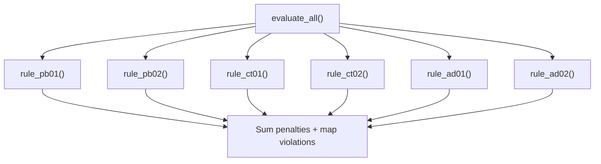
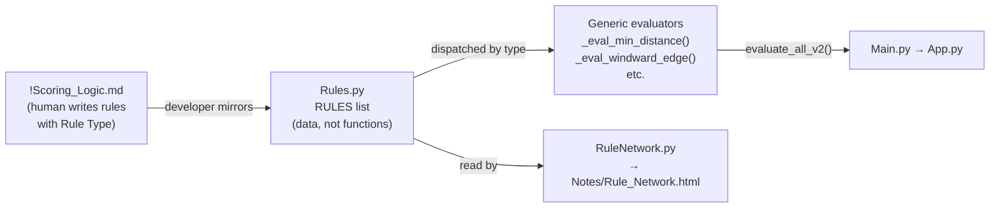
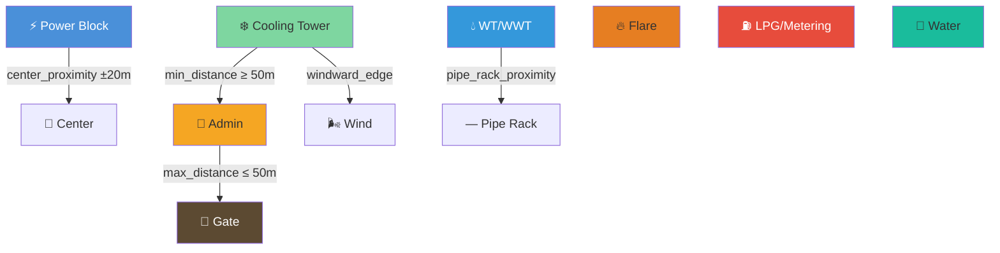

# How the Rules Engine Works — Phase 03 → Phase 04

## Current Architecture (Phase 03)

### The Pipeline


Right now, the process is **manual per-rule coding**:
1. You write a rule row in `!Scoring_Logic.md`
2. A developer hand-codes a **separate Python function** for each rule in `Rules.py`

---

### How a Single Rule Works

Tracing **CT-02** (Cooling Tower ↔ Admin Building minimum distance):

#### Step 1 — `!Scoring_Logic.md` has this row:

| ID | Group | Constraint | Target | Penalty | Condition |
|----|-------|-----------|--------|---------|-----------|
| CT-02 | Cooling Tower | Minimum Distance | Admin Building | 500 pts/m | If distance < 50m |

#### Step 2 — Developer writes `rule_ct02()` in `Rules.py`:

```python
def rule_ct02(cooling_tower, admin_building):
    ct_cx, ct_cy = _center(cooling_tower)
    adm_cx, adm_cy = _center(admin_building)
    distance = _dist(ct_cx, ct_cy, adm_cx, adm_cy)
    shortfall = max(0.0, 50.0 - distance)
    penalty = shortfall * 500
    return _result("CT-02", "CT ↔ Admin: Min Dist", ...)
```

#### Step 3 — Every rule returns a standardized result dict:

```python
{
    "id":        "CT-02",
    "name":      "CT ↔ Admin: Min Dist",
    "group":     "Cooling Tower",       # which building gets RED border
    "passed":    True/False,
    "penalty":   0 or N,                # lower = better
    "message":   "human readable",
    "measured":  "CT center → Admin center: 72.3 m",
    "threshold": "≥ 50 m",
    "calc":      "0 pts (distance OK)",
}
```

### The 5 Rule Patterns (Phase 03)

| Pattern | Example | Penalty |
|---------|---------|---------|
| **Center proximity** | PB-01: Power Block near plot center | `excess × rate` |
| **Boundary setback** | PB-02: 5m from all edges | Flat (5000 pts) |
| **Windward edge** | CT-01: CT on wind side | Flat (1000 pts) |
| **Min distance** | CT-02: CT ≥ 50m from Admin | `shortfall × rate` |
| **Max distance** | AD-02: Admin ≤ 50m from Gate | `excess × rate` |

### The Master Evaluator

`evaluate_all()` runs all 6 rules, sums penalties, and maps violations by building name:



---

## Phase 04 Architecture

### What Changes

| Aspect | Phase 03 | Phase 04 |
|--------|----------|----------|
| Groups | 3 rectangles | 9 rectangles + 3 polyline racks = 12 |
| Rule functions | 6 hand-coded (`rule_pb01`, `rule_ct02`...) | Generic by Rule Type (`_eval_min_distance`, `_eval_windward_edge`...) |
| Adding a rule | Write function + wire into `evaluate_all()` | Add dict to `RULES` list + update `!Scoring_Logic.md` |
| `!Scoring_Logic.md` | No Rule Type column | **Rule Type column** mapping to generic functions |
| Rule Network | None | `Notes/Rule_Network.html` — standalone Pyvis graph |

### The New Pipeline



### The 12 Groups

**9 Rectangles:**
Power Block, Cooling Tower, Admin Building, Gate House, Cable Tunnel, LPG/Metering, Flare, WT/WWT, Water

**3 Polyline Racks** (straight lines, not rectangles):
Pipe Rack, Main Rack, Utility Rack

### `!Scoring_Logic.md` — New Format

The table gains a **Rule Type** column that tells you exactly which generic function handles it:

```markdown
| ID    | Group         | Rule Type          | Target         | Threshold | Penalty     |
| PB-01 | Power Block   | center_proximity   | Plot Center    | 20 m      | 100 pts/m   |
| PB-02 | Power Block   | boundary_setback   | Primary Road   | 5 m       | 5000 pts    |
| CT-01 | Cooling Tower | windward_edge      | Wind Direction | 30 m      | 1000 pts    |
| CT-02 | Cooling Tower | min_distance       | Admin Building | 50 m      | 500 pts/m   |
```

### `Rules.py` — RULES Data List

Each row from `!Scoring_Logic.md` becomes a dict in the `RULES` list:

```python
RULES = [
    {"id": "PB-01", "type": "center_proximity", "group": "Power Block",
     "target": "Plot Center", "threshold": 20, "penalty_rate": 100, "penalty_mode": "linear"},
    {"id": "CT-02", "type": "min_distance", "group": "Cooling Tower",
     "target": "Admin Building", "threshold": 50, "penalty_rate": 500, "penalty_mode": "linear"},
    # ... add more rows = add more rules, no new functions needed
]
```

### Generic Evaluators

Instead of one function per rule, there's one function per **Rule Type**:

```python
# OLD — one function per rule:
def rule_ct02(cooling_tower, admin_building): ...
def rule_ad02(admin_building, site_width): ...

# NEW — one function per type, reused for any rule of that type:
def _eval_min_distance(building_a, building_b, threshold, rate): ...
def _eval_max_distance(building_a, building_b, threshold, rate): ...
```

The dispatcher `evaluate_all_v2()` loops through `RULES` and calls the right generic function:

```python
def evaluate_all_v2(groups, racks, site_w, site_l, wind_dir):
    results = []
    for rule in RULES:
        if rule["type"] == "min_distance":
            r = _eval_min_distance(groups[rule["group"]], groups[rule["target"]], ...)
        elif rule["type"] == "windward_edge":
            r = _eval_windward_edge(groups[rule["group"]], site_w, site_l, wind_dir, ...)
        # ... etc
        results.append(r)
    return {"results": results, "total_penalty": sum(...), ...}
```

### Rule Network Visualization

`Core/RuleNetwork.py` reads the `RULES` list and generates an interactive graph:



Run `python Core/RuleNetwork.py` → opens `Notes/Rule_Network.html` in browser.

### Polyline Racks

Racks are stored differently from rectangular groups:

```python
# Rectangle group:
{"name": "Power Block", "type": "rect", "x": 140, "y": 110, "width": 120, "height": 80, "color": "#4a90d9"}

# Polyline rack:
{"name": "Main Rack", "type": "rack", "start": (140, 150), "end": (300, 150), "color": "#7f8c8d", "width_m": 8}
```

Rendered as dashed thick lines on the plot, not filled rectangles.
