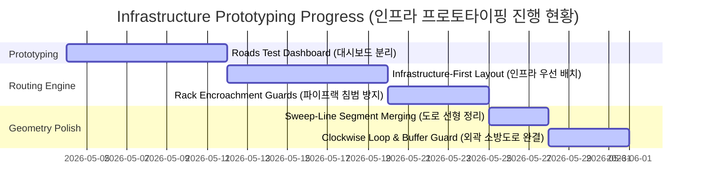
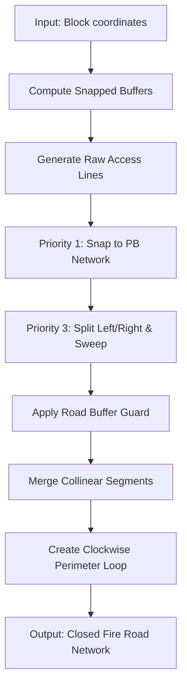
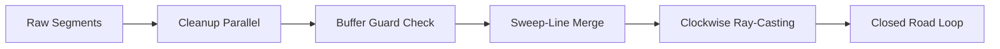

# Monthly Progress Report (월간 진행 보고서)

## 1. Summary of Milestones (주요 마일스톤 요약)

---

## 2. Korean Report (한국어 보고서)

### 2.1 개발 요약 (Accomplishments)

| 개발 기능          | 세부 성과                                 | 비고                      |
| :------------- | :------------------------------------ | :---------------------- |
| **대시보드 분리**    | `Roads_Test.py` 신규 개발. 도로망 독립 프로토타이핑. | 개발 생산성 대폭 향상.           |
| **인프라 배치**     | 도로 Corridor 생성. 건물 배치 연계 최적화.         | Phase 06 엔진 통합 완료.      |
| **파이프랙 간섭 방지** | 6m 건물 인플레이션 적용.                       |                         |
| **도로 선형 최적화**  | Sweep-line 인터벌 병합. 중복 선로 완벽 청소.       | 평행 도로 병목 해결.            |
| **소방 도로 폐합**   | 시계방향 레이캐스팅 기법. 외곽 도로 완전 폐합.           | zero-distance 코너 버그 해결. |
| **도로 안전 버퍼**   | Priority 3 스윕 제한. 건물 버퍼 침범 금지.        | Buffer Guard 조건 완결.     |

### 2.2 기술 구성도 (Architecture Scheme)

---

## 3. English Report (영어 보고서)

### 3.1 Accomplishments Summary

| Feature | Details | Remarks |
| :--- | :--- | :--- |
| **Separated Dashboard** | Created `Roads_Test.py`. Isolated roads testing. | Accelerated prototyping speed. |
| **Infrastructure-First Layout**| Prioritized road corridors. Managed block geometry. | Phase 06 engine finalized. |
| **Encroachment Guards** | Applied 6m inflation. Avoided WT/WWT blocks. | Secure rack routing verified. |
| **Collinear Merging** | Sweep-line interval merge. Cleaned parallel segments. | Transitive deformation bugs resolved. |
| **Perimeter Loop Closure**| Clockwise ray-caster loop. Closed perimeter roads. | Zero-distance corner bug fixed. |
| **Road Buffer Guard** | Controlled Priority 3. Prevented buffer intrusion. | Enforced clear setbacks. |

### 3.2 System Flowchart

