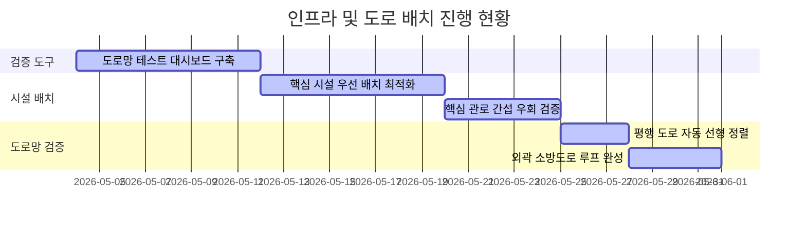
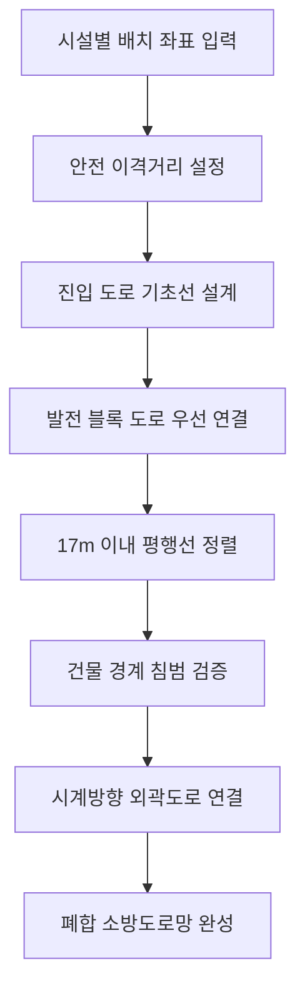

# 주간 진행 보고서 (Weekly Progress Report)

## 1. 종합 배치 계획 (Project Layout Plan)
* **부지 규격**: 500m × 270m
* **이격 제약**: 외곽 경계 10m 확보
* **도로 제약**: 일반 도로 8m 폭, 주요 관로 14m/16m/28m 폭 확보

---

## 2. 주요 성과 (Key Accomplishments)

| 구분 (시설/도로) | 개선 사항 및 규칙 | 효과 |
| :--- | :--- | :--- |
| **테스트 대시보드** | `Roads_Test.py` 개발 완료. 도로 전용 화면 구성. | 배치 검증 속도 향상. |
| **발전 블록 (Power Block)** | 발전 핵심 구역 중심 배치. 기준 도로망 연결 자동화. | 배치 기준점 확립. |
| **관로 간섭 우회** | Flare 관로 주변 6m 가드라인 설정. | 수처리 시설 (WT/WWT) 안전 거리 확보. |
| **도로 평행 정렬** | 17m 이내 평행 도로 자동 합체. | 불필요한 도로 제거. |
| **외곽 소방도로** | 시계방향 90도 회전 연결. 막힌 도로 전면 해소. | 안전 소방 통로 구축. |
| **도로 안전 버퍼** | 건물 경계 침범 전면 통제. | 건물 간 안전 이격 준수. |

---

## 3. 도로 생성 흐름도 (Road Routing Flow)

