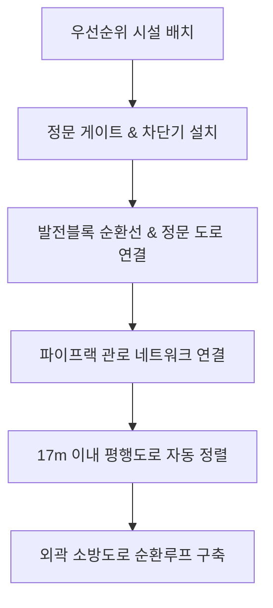

# 주간 진행 보고서 (Weekly Progress Report)

## 1. 종합 배치 계획 (Project Layout Plan)
* **부지 규격**: 500m × 270m
* **이격 제약**: 외곽 경계 10m 확보
* **도로 제약**: 일반 도로 8m 폭

---

## 2. 주요 성과 (Key Accomplishments)

| 주요 성과 및 개선 사항 | 효과 |
| :--- | :--- |
| **전용 대시보드 (`Roads_Test.py`)** | 신속 검증 가능. |
| **건물 규격 (주차 공간 제외)** | 배치 유연성 확보. |
| **주요 시설 우선 배치** | 배치 기준점 설정. |
| **정문 및 16m 차단기** | 차량 통제용. |
| **발전블록 순환선 및 진입로** | 핵심 연계 완료. |
| **주요 시설 관로 연결** | 파이프랙 구축 완료. |
| **소방 도로 순환루프** | 외곽 폐합 진행. |

---

## 3. 도로 생성 흐름도 (Road Routing Flow)

